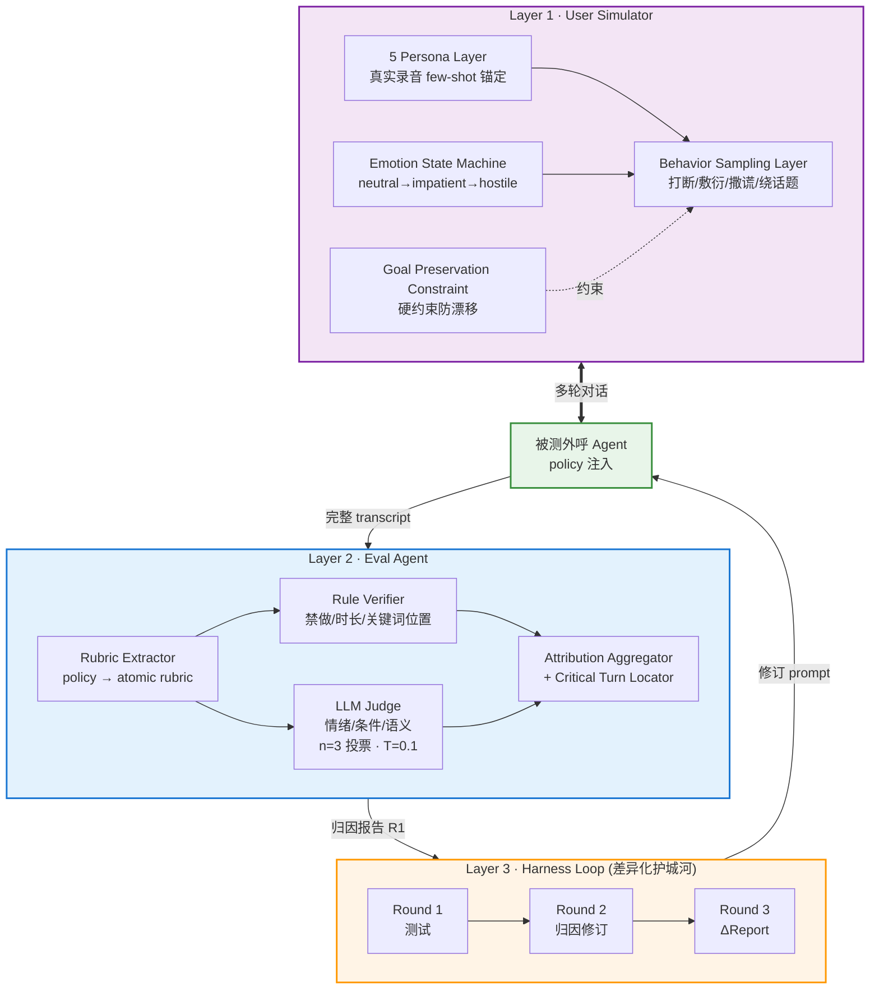
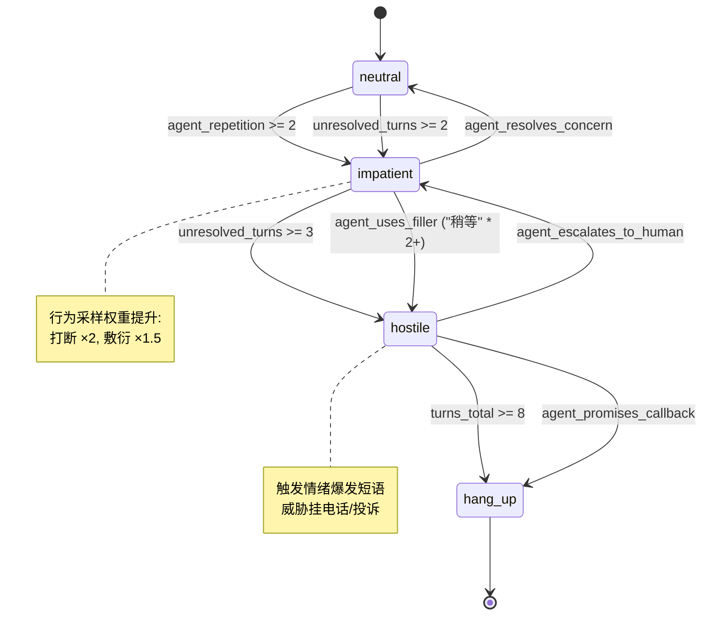
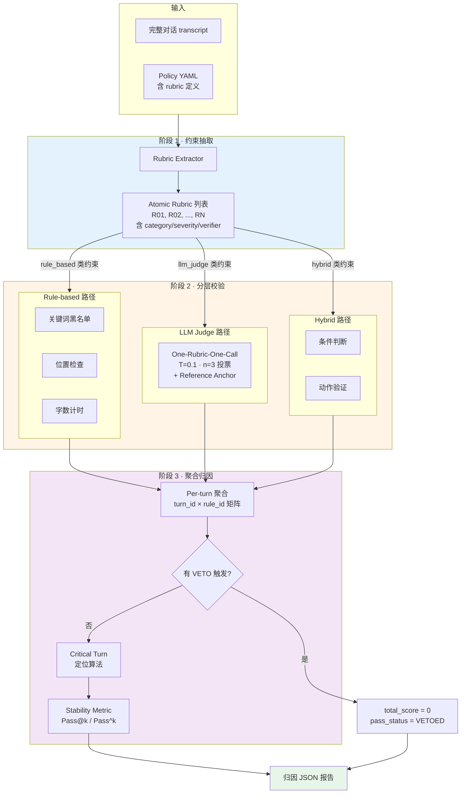
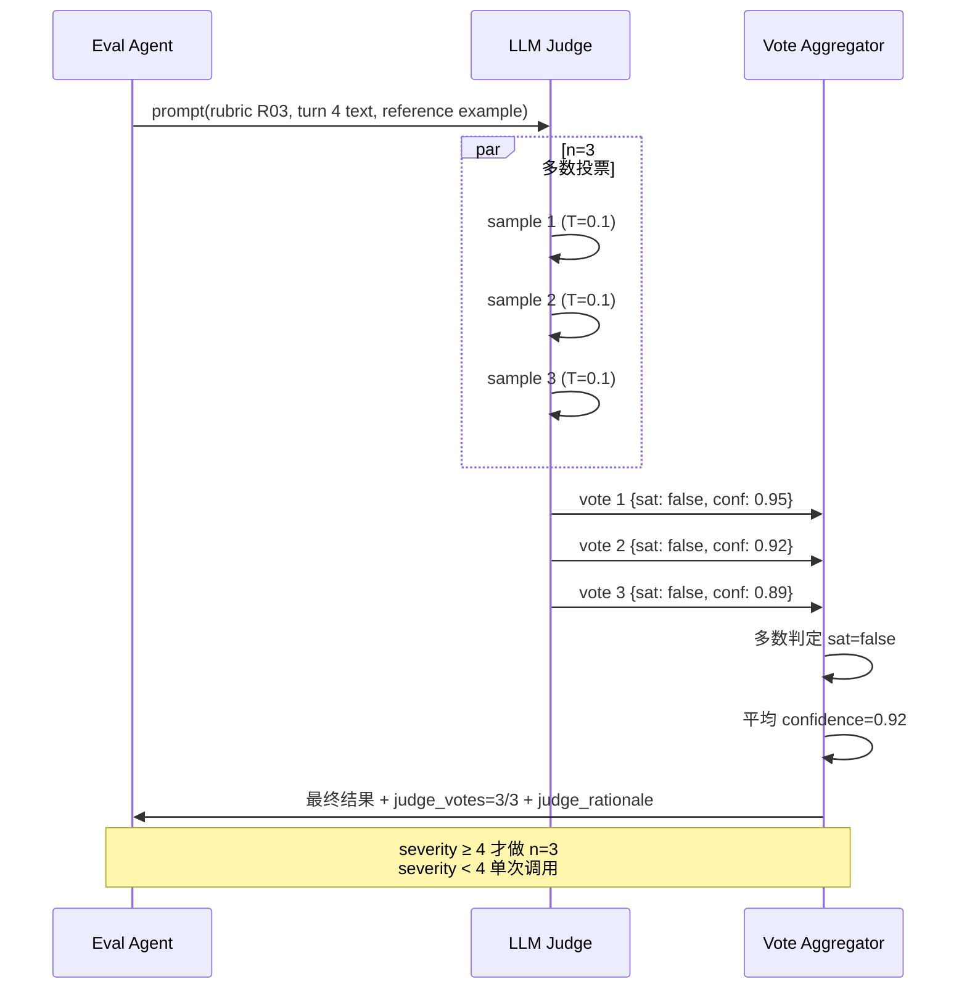
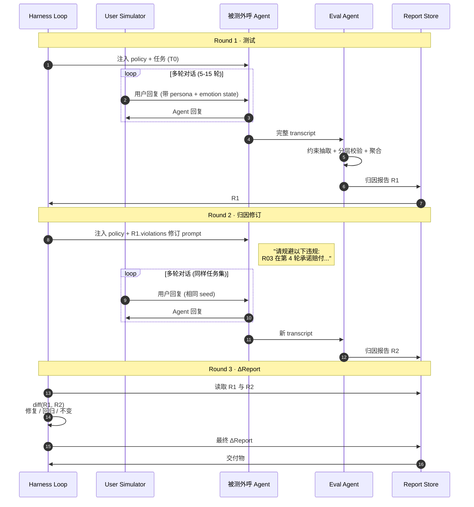
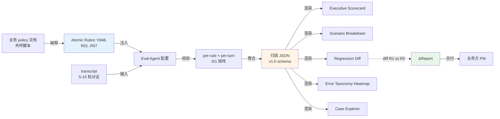

# 架构图 · 复杂指令多轮对话评测系统

> 本文档配套 [`PRD.md`](./PRD.md)，提供 5 张架构图：整体三层架构、User Simulator 内部结构、Eval Agent 评分流水、Harness Loop 时序、归因报告生命周期。
> 所有图用 Mermaid 绘制，可直接复制到飞书 / Notion / GitHub 渲染。

---

## 图 1 · 整体三层架构



**关键说明：**
- L1 与被测 Agent 双向多轮对话 → 产出 transcript
- L2 接收 transcript → 输出结构化归因报告
- L3 以 L2 的报告作为输入，驱动被测 Agent 自我修订并重测
- 数据流不是单向流水线，而是 **带反馈的闭环**

---

## 图 2 · User Simulator 内部结构

```mermaid
flowchart LR
    subgraph INPUT["输入"]
        TASK[任务目标<br/>订单号/地址/时间]
        POL[业务上下文<br/>骑手状态/场景类型]
        PER[Persona ID]
    end

    subgraph PER_LAYER["Persona Layer (5 种)"]
        P1[急单骑手]
        P2[信息矛盾型]
        P3[绕话题型]
        P4[情绪激动型]
        P5[低理解力型]
        FS[Few-shot 语料库<br/>50-100 条真实录音]
    end

    subgraph CTRL["控制层"]
        BSL[Behavior Sampling<br/>每轮概率抽取]
        ESM[Emotion State Machine<br/>4 态]
        GPC[Goal Preservation<br/>硬约束]
    end

    subgraph GEN["生成层"]
        LLM[Base LLM<br/>Sonnet 4.6]
        RESP[Simulator 回复<br/>+ meta 标签]
    end

    INPUT --> PER_LAYER
    PER_LAYER --persona prompt + few-shot--> CTRL
    CTRL --decoded prompt--> LLM
    LLM --> RESP
    RESP -."turn_count++"..-> CTRL

    style PER_LAYER fill:#f3e5f5
    style CTRL fill:#fff4e6
    style GEN fill:#e3f2fd
```



### Emotion State Machine 详细状态图



---

## 图 3 · Eval Agent 评分流水



### LLM Judge 单次调用细节



---

## 图 4 · Harness Loop 三轮时序



---

## 图 5 · 归因报告生命周期



---

## 图 6 · 与 VitaBench 关系示意

```mermaid
flowchart TB
    subgraph VB["VitaBench (命题方已发布)"]
        VB1[POMDP rollout]
        VB2[Sliding window evaluator]
        VB3[Atomic rubric criteria]
        VB4[5 静态 persona simulator]
        VB5[All-or-nothing 评分]
        VB6[外卖/到店/旅行 三域]
        VB7[Pass@k 单指标]
        VB8[单跑无修订]
    end

    subgraph OURS["本方案 (风云延伸)"]
        O1[继承 POMDP rollout]
        O2[继承 Sliding window]
        O3[继承 Atomic rubric]
        O4[延伸 1: 动态情绪状态机 Simulator]
        O5[延伸 2: Per-turn 归因报告]
        O6[延伸 3: 电话外呼新域]
        O7[延伸 4: Pass^k/Pass@k 稳定性指标]
        O8[延伸 5: Harness Loop 三轮修订]
    end

    VB1 ==> O1
    VB2 ==> O2
    VB3 ==> O3
    VB4 -.被替换.-> O4
    VB5 -.被替换.-> O5
    VB6 -.被扩展.-> O6
    VB7 -.被扩展.-> O7
    VB8 -.被扩展.-> O8

    style VB fill:#f5f5f5,stroke:#999,stroke-width:1px
    style OURS fill:#fff4e6,stroke:#ff9800,stroke-width:2px
    style O4 fill:#ffe0b2
    style O5 fill:#ffe0b2
    style O6 fill:#ffe0b2
    style O7 fill:#ffe0b2
    style O8 fill:#ffe0b2
```

---

## 数据流摘要

```
业务 policy → Rubric Extractor → Atomic Rubric (R01..R07)
                                      ↓
User Simulator ←→ 被测 Agent → transcript
                                      ↓
                            Rule Verifier + LLM Judge (n=3)
                                      ↓
                            Per-turn × Per-rule 矩阵
                                      ↓
                    VETO 检查 → Critical Turn → Stability Metric
                                      ↓
                            归因 JSON (R1)
                                      ↓
       Round 2: violation 注入被测 Agent → 重跑 → R2
                                      ↓
                            ΔReport (修复 / 回归 / 不变)
                                      ↓
                     5 页 Dashboard → 业务方 PM
```
